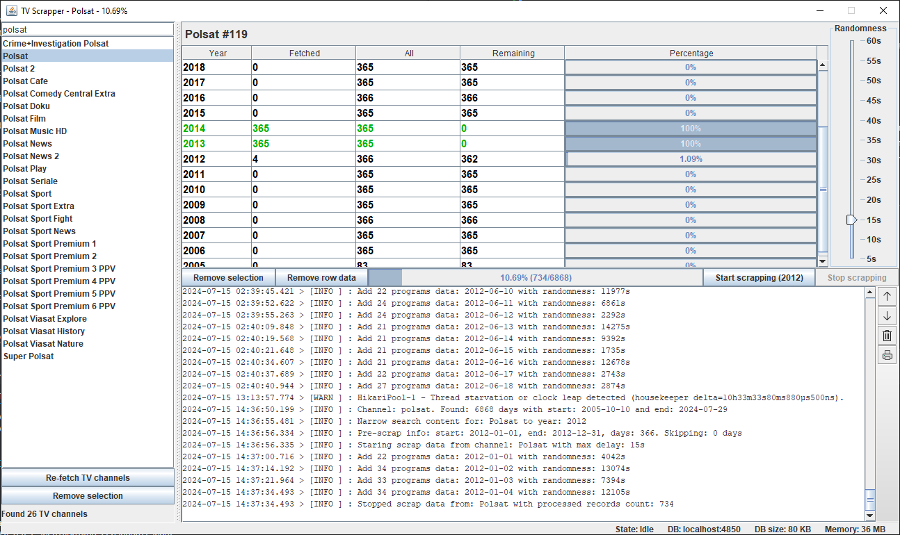
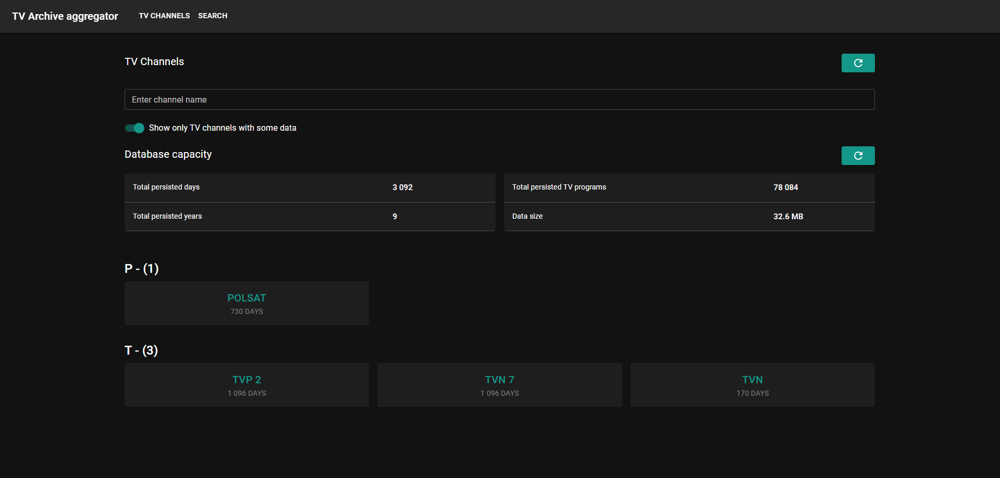
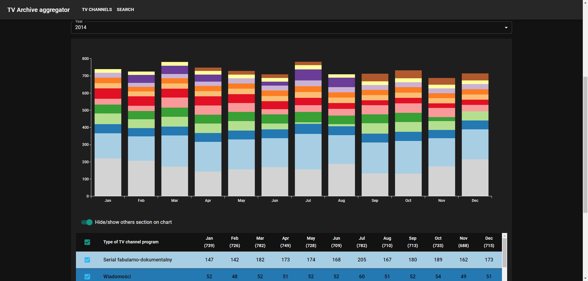
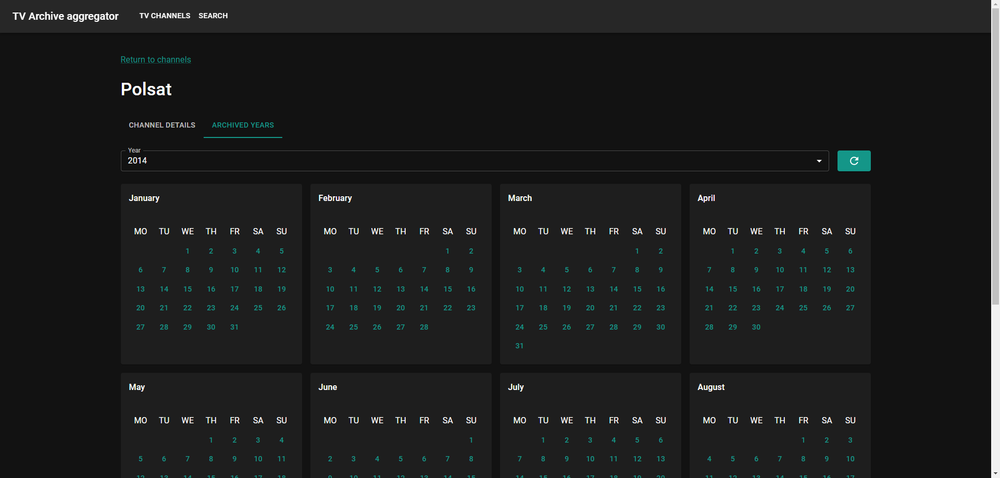
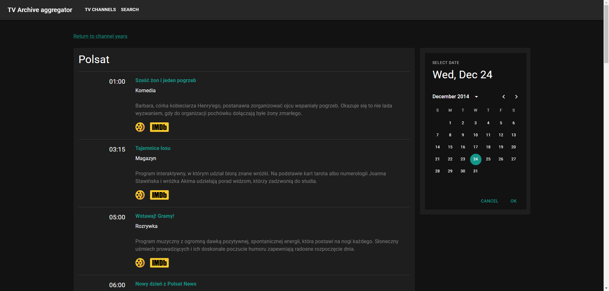
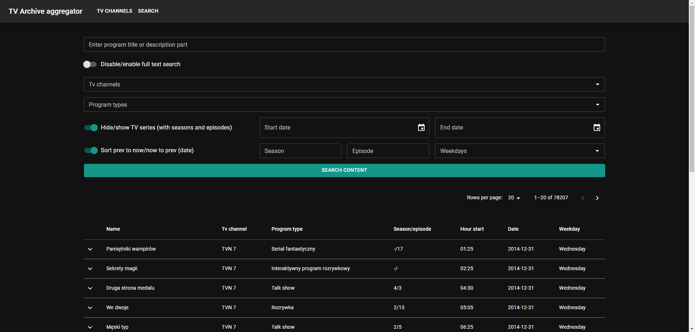

# TV archives aggregator

[[Docker image](https://hub.docker.com/r/milosz08/tv-archives-aggregator-client)] |
[[About project](https://miloszgilga.pl/project/tv-archives-aggregator)]

TV archive aggregator scrapping content from [telemagazyn.pl](https://telemagazyn.pl) and indexing
it with more comfortable search system.

## Table of content

* [Features](#features)
* [Gallery](#gallery)
* [Prerequisites](#prerequisites)
* [Clone and install](#clone-and-install)
* [Prepare develop environment](#prepare-develop-environment)
* [Create executable JAR file (bare-metal)](#create-executable-jar-file-bare-metal)
* [Tech stack](#tech-stack)
* [Author](#author)
* [License](#license)

## Features

The main goal of this project is to improve the archiving system for TV programs and make them more
easily searchable for interesting content from a given time period.

This project consists of 3 subprojects:

- **app-scrapper** - scrapping data from website and saving in DB (desktop Java Swing app),
- **app-backend** - Rest API written in Spring Boot,
- **app-frontend** - Web client written in React and MUI component library.

Main features:

* make availability to scrap content from [telemagazyn.pl](https://telemagazyn.pl) and saving in
  defined structure in MySQL database,
* provide web API for preexisting web client or other clients (for example mobile),
* provide web UI for searching content by program type, TV channel or genre with advanced search
  system and additional data visualization tools.

## Gallery

<details>
  <summary>Click to expand gallery</summary><br>
  <br><br>
  <br><br>
  <br><br>
  <br><br>
  <br><br>
  
</details>

## Prerequisites

* for develop environment:
  * Node v20 or higher (and corresponding NPM installation),
  * JDK 17 or higher,
  * Docker.
* for running environment:
  * JRE 17 or higher (only for desktop **app-scrapper** app),
  * Docker.

## Clone and install

1. To install the program on your computer, use the command below:

```bash
$ git clone https://github.com/milosz08/tv-archives-aggregator
```

2. Create docker containers for **tv-archives-aggregator-mysql-db**,
   **tv-archives-aggregator-phpmyadmin**  and MySQL database via:

```bash
$ docker-compose up -d
```

This command should create 3 docker containers:

| Application                       | Port                          | Description                      |
|-----------------------------------|-------------------------------|----------------------------------|
| tv-archives-aggregator-mysql-db   | [4850](http://localhost:4850) | MySQL database                   |
| tv-archives-aggregator-phpmyadmin | [4851](http://localhost:4851) | MySQL database client            |
| tv-archives-aggregator-client     | [4852](http://localhost:4852) | Application (frontend + backend) |

> [!TIP]
> If you have already MySQL database client, you can omit creating
> `tv-archives-aggregator-phpmyadmin` container. To omit, create only MySQL db container
> via: `$ docker compose up -d tv-archives-aggregator-mysql-db tv-archives-aggregator-client`.

3. Download latest release of **app-scrapper** desktop app from this repository (available binaries
   with embedded JVM) for macOS (dmg), Linux (rpm, deb) and Windows (msi) and install it via
   standard installer procedure.

4. Alternative you can build binaries by you own directly from sources (for Windows, you must have
   [wix3](https://github.com/wixtoolset/wix3/releases) in your environment PATH):

> [!NOTE]
> The build command (`$ ./mvnw clean package -pl app-scrapper`) must be run on the target operating
> system. It will automatically detect the OS (Windows, macOS, Linux) and build the corresponding
> native executable in `target/installer`.

5. Optionally, create `.env` file inside your installed application directory and insert listed data
   below:

```properties
DB_HOST=localhost
DB_PORT=4850
DB_USERNAME=root
DB_PASSWORD=admin
DB_NAME=aggregator-db
```

> [!TIP]
> Please note that on its first launch, the application downloads the entire Chromium engine. This
> is necessary to bypass Cloudflare's verification mechanisms, so the initial startup may take quite
> a long time. For debugging purposes (on Windows systems), you can add the `--win-console` flag in
> the jpackage settings. On Unix no special flag is necessary.

## Prepare develop environment

1. Clone and install via `git clone` command (see *Clone and install* section).
2. Create `.env` file based `example.env` in root directory with following content:

```properties
# ports (should not be changed)
TV_ARCHIVES_AGGREGATOR_MYSQL_PORT=4850
TV_ARCHIVES_AGGREGATOR_PHPMYADMIN_PORT=4851
TV_ARCHIVES_AGGREGATOR_CLIENT_PORT=4852
# credentials (can be changed)
TV_ARCHIVES_AGGREGATOR_MYSQL_PASSWORD=admin
```

3. Go to root directory and run MySQL database via:

```bash
$ docker-compose up -d tv-archives-aggregator-mysql-db tv-archives-aggregator-phpmyadmin
```

> [!TIP]
> If you have already MySQL database client, you can omit creating
> `tv-archives-aggregator-phpmyadmin` container. To omit, create only MySQL db container
> via: `$ docker compose up -d tv-archives-aggregator-mysql-db`.

This command should initialize MySQL database with content located inside
`.volumes/mysql/init/init.sql` file.

4. Setup **app-frontend**:

* Go to frontend directory (`$ cd app-frontend`) and install all dependencies via:

```bash
$ yarn install --frozen-lockfile
```

> [!TIP]
> If you do not have yarn, install via: `npm i -g yarn`.

* Run client via:

```bash
$ yarn run dev
```

* Alternatively to run development server, type:

```bash
$ yarn run preview
```

Development server should be available at `4853` TCP port.

5. Setup **app-backend**:

* Go to backend directory (`$ cd app-backend`) and type (for UNIX):

```bash
$ ./mvnw clean install
$ ./mvnw spring-boot:run
```

or for Windows:

```bash
.\mvnw.cmd clean install
.\mvnw.cmd spring-boot:run
```

* Check application state via endpoint: [/actuator/health](http://localhost:4852/actuator/health).
  If response show this:

```json
{
  "status": "UP"
}
```

application is running and waiting for HTTP requests.

6. Setup **app-scrapper**:

* This application is a Java Swing app and can be run from Intellij configuration (located in `.run`
  directory).

## Create executable JAR file (bare-metal)

1. To create executable JAR file for client app (**app-frontend** + **app-backend**,
   **app-scrapper**), you must type (for UNIX):

```bash
$ ./mvnw clean package
```

or for Windows:

```bash
.\mvnw.cmd clean package
```

Output JAR files will be located inside `.bin` directory. With this file you can run app in
bare-metal environment without virtualization via:

* for client (**app-frontend** + **app-backend**)

```bash
$ java \
  -Xms1024m \
  -Xmx1024m \
  -Dserver.port=8080 \
  -jar tv-archives-aggreagator-client.jar
```

## Tech stack

* Java SE 17
* JSoup, Playwright Java, Chromium
* Swing UI
* Spring Boot 3
* MySQL with JDBC Spring data
* React with Tanstack Query
* MUI components library

## Author

Created by Miłosz Gilga. If you have any questions about this application, send
message: [miloszgilga@gmail.com](mailto:miloszgilga@gmail.com).

## License

This project is licensed under the Apache 2.0 License.
